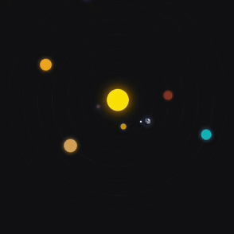

# Sistema Solar com CSS 

Uma simulação visual interativa do **[Sistema Solar](https://ninja1375.github.io/Sistema-Solar-com-CSS/)** criada com HTML e CSS. Este projeto apresenta animações das órbitas dos planetas em torno do Sol e da Lua em torno da Terra.

## Descrição

Este projeto recria uma representação simplificada do Sistema Solar, destacando os planetas e suas respectivas órbitas ao redor do Sol. Além disso, a Terra inclui um detalhe extra: sua lua orbitando de forma contínua. As animações dão um aspecto dinâmico ao projeto.

### Funcionalidades

- Representação visual de planetas com tamanhos e cores diferenciados.
- Animação das órbitas planetárias.
- Detalhamento da Lua orbitando ao redor da Terra.
- Totalmente responsivo para diferentes resoluções de tela.

## Tecnologias Utilizadas

<a href="https://programartudo.blogspot.com/2024/11/html-tudo-o-que-precisa-para-comecar.html" target="_blank"></a> 
<a href="https://programartudo.blogspot.com/2024/11/css-como-dar-estilo-ao-teu-website.html" target="_blank"></a>

- **HTML5**: Estrutura básica do projeto.
- **CSS3**: Estilização e animações dos planetas, órbitas e do sistema solar.

## Estrutura do Projeto

- `index.html`: Estrutura HTML do sistema solar.
- `style.css`: Estilos e animações do projeto.
- **Recursos externos**: Imagem da Terra para enriquecer a simulação visual.

## Pré-visualização

Veja o layout básico do sistema solar:

- Planetas incluídos: Mercúrio, Vênus, Terra (com Lua), Marte, Júpiter, Saturno, Urano e Netuno.
- Simulação realista de órbitas com velocidades diferentes.

## Prévia


## Como Executar

1. Clone o repositório para o seu ambiente local:
   ```bash
   git clone https://github.com/ninja1375/sistema-solar-com-css.git
   ```
2. Navegue até o diretório do projeto:
   ```bash
   cd sistema-solar-com-css
   ```
3. Abra o arquivo `index.html` em um navegador para visualizar a simulação.

## Contribuições

Contribuições são bem-vindas! Siga os passos abaixo:

1. Faça um fork do repositório.

2. Crie uma nova branch:
   ```bash
   git checkout -b feature/sua-feature
   ```
3. Faça suas alterações e commit:
   ```bash
   git commit -m "Adicionando nova feature"
   ```
4. Envie um pull request.

## Apoie-me:

<a href="https://buymeacoffee.com/antonio13" target="_blank"></a>

<a href="https://www.paypal.com/donate/?hosted_button_id=DN574F28FYUNG" target="_blank"></a>
